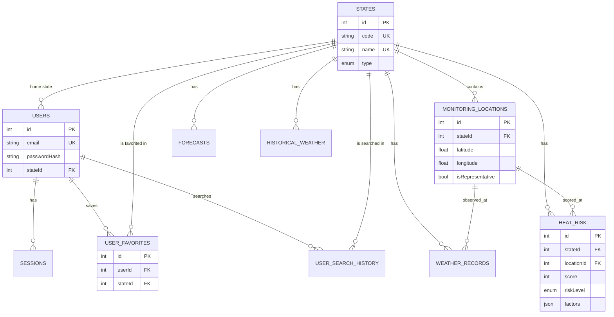

# ClimateIQ — Climate Intelligence & Heatwave Early Warning System for India

ClimateIQ is a database-driven climate intelligence and heat-risk monitoring platform. It combines **live Open-Meteo weather**, a **transparent heat-risk engine**, an **interactive Leaflet map of India** with real State/UT boundaries, and a **PostgreSQL database** (via Prisma ORM) that stores users, favorites, search history, weather snapshots, forecasts, historical weather and calculated risk.

> Risk levels shown by this system are project-defined estimates based on current and forecast weather variables. They are **not** official government heatwave warnings.

---

## 1. Problem statement

Heatwaves are among India's deadliest weather hazards, and heat stress depends on more than air temperature alone: humidity, persistence of hot days and departure from seasonal normals all matter. Weather apps show the temperature for one place. They don't show where across the country heat risk is building, why, or what to do about it.

## 2. Objectives

1. Monitor live weather at fixed, real geographic locations covering all 28 States and 8 Union Territories.
2. Convert weather into an explainable 0–100 **System-Generated Heat-Risk Estimate**.
3. Visualise risk on an interactive India map with real administrative boundaries.
4. Provide 7-day forecasts, historical weather analysis and safety guidance.
5. Demonstrate a normalised relational database with authentication and full CRUD.

## 3. Features

| Area | What it does |
|---|---|
| **Live India heat-risk map** | Leaflet map with State/UT GeoJSON boundaries and 67 monitoring points coloured by live risk. Layers: state boundaries, live points, state risk shading, heatmap, temperature labels, humidity labels, 7-day forecast risk. Risk filter, legend, hover tooltips, popups with **View details / Select state**, auto-refresh every 15 min, manual **Refresh Live Data**. |
| **Global selected state** | One shared selection (`?state=MH` in the URL), set by dropdown, search box or a map click, and used by every page. |
| **Dashboard** | Map-first console: current weather, heat-risk gauge, 7-day forecast, past-vs-next comparison, safety recommendation, favorites and recent searches. |
| **Forecast** | 7-day table and charts (all temperatures, maximum, minimum) with a per-day heat-risk estimate. |
| **Historical** | Observed daily weather for the last 7 / 30 days or a custom range (1940 → yesterday): line and bar charts, statistics, table. |
| **Heat risk** | Score, level, factor breakdown, "Why this risk?" explanation, methodology, 48-hour score trend from the database, other points in the state. |
| **Safety / Emergency** | Risk-specific guidance (from DB), verified national emergency numbers, nearby-hospital search (geolocation optional). |
| **Accounts** | Register, login, logout, profile update, account deletion; favorites and search history. |
| **UX** | Light/dark mode, responsive (desktop/tablet/mobile), skeletons, loading, error and empty states, "Showing cached data" labels. |

## 4. Technology stack

| Layer | Technology |
|---|---|
| Frontend | Next.js 16 (App Router), React 19, JavaScript (JSX), CSS (organised global stylesheet `styles/globals.css`) |
| Backend | Next.js Route Handlers (`app/api/**/route.js`) |
| Database | PostgreSQL (hosted on Supabase) |
| ORM | Prisma 6 (schema, migrations, relations, parameterised queries) |
| External API | Open-Meteo (forecast, ERA5 archive) — free, no API key |
| Map | Leaflet 1.9 + leaflet.heat, Esri gray canvas basemap |
| Geographic data | India State/UT GeoJSON (`public/geojson/india-states.geojson`) |
| Charts | Chart.js 4 + react-chartjs-2 |
| Auth | bcrypt password hashing, server-side sessions, HTTP-only cookies |

## 5. Architecture

```text
Browser (React client components)
   │  fetch /api/...
   ▼
Next.js Route Handlers ──────────────► Open-Meteo (forecast + ERA5 archive)
   │        │                                │
   │        └── lib/riskService.js ◄─────────┘   one batched multi-location request
   │              │  lib/heatRisk.js (scoring engine)
   │              │  in-memory cache (15 min) + request de-duplication
   ▼              ▼
Prisma ORM  ──►  PostgreSQL
```

**Live heat-risk pipeline**

```text
Monitoring point (DB: monitoring_locations, real lat/lon)
   → Open-Meteo current + 7-day forecast (one request for all 67 points)
   → 5-year same-season baseline (ERA5 archive, cached 24 h)
   → Heat-risk engine (lib/heatRisk.js) → score 0–100 + level + factors
   → stored in PostgreSQL (weather_records, heat_risk, forecasts)
   → /api/map/risk → Leaflet markers, state shading, heatmap
```

If Open-Meteo is unreachable, the last snapshot stored in PostgreSQL is served and clearly labelled **"Showing cached data"**. No weather value is ever invented.

### Folder structure

```text
app/
├── page.js                 Landing page (live hotspots)
├── login/  register/       Auth pages
├── (app)/                  App shell (sidebar, topbar, selected-state provider)
│   ├── dashboard/  map/  forecast/  historical/  heat-risk/
│   ├── safety/  emergency/  favorites/  profile/
└── api/                    Route handlers (see §10)
components/                 IndiaMap, LiveMap, StateSelector, WeatherCard, HeatRiskCard,
                            ForecastPanel, HistoricalChart, RiskLegend, UserData, AppShell…
lib/
├── prisma.js               PrismaClient singleton
├── openMeteo.js            The only module that calls Open-Meteo
├── heatRisk.js             Heat-risk engine (pure, unit-tested)
├── riskService.js          Snapshot pipeline, caching, persistence, DB fallback
├── auth.js                 Hashing, sessions, cookies
├── states.js               36 States/UTs, codes, GeoJSON mapping, monitoring coordinates
├── riskLevels.js  weatherCodes.js  validation.js  rateLimit.js  cache.js  format.js
prisma/
├── schema.prisma  migrations/  seed.mjs
public/geojson/india-states.geojson
styles/globals.css
tests/heatRisk.test.mjs
proxy.js                    Optimistic route protection (Next.js 16 "proxy", formerly middleware)
```

## 6. Database schema

| Table | Key columns | Notes |
|---|---|---|
| `users` | id PK, fullName, **email UNIQUE**, passwordHash, phoneNumber, city, stateId FK→states, createdAt, updatedAt | bcrypt hash only, never plaintext |
| `sessions` | id PK, **tokenHash UNIQUE**, userId FK→users (CASCADE), expiresAt | stores HMAC of the cookie token |
| `states` | id PK, **name UNIQUE**, **code UNIQUE**, type (STATE / UNION_TERRITORY), capital, latitude, longitude | 36 rows |
| `monitoring_locations` | id PK, name, stateId FK, latitude, longitude, isRepresentative; UNIQUE(name, stateId) | 67 real city coordinates, **no weather values** |
| `weather_records` | id PK, stateId FK, locationId FK, latitude, longitude, temperature, apparentTemperature, humidity, weatherCode, weatherCondition, windSpeed, observedAt, recordedAt | one row per point per refresh |
| `forecasts` | id PK, stateId FK, date, min/max/apparent temperature, weatherCondition, precipitation, windSpeed, riskScore, riskLevel; UNIQUE(stateId, date) | representative location |
| `historical_weather` | id PK, stateId FK, date, min/max/average/apparent temperature, source; UNIQUE(stateId, date) | filled when history is viewed |
| `heat_risk` | id PK, stateId FK, locationId FK, latitude, longitude, temperature, apparentTemperature, humidity, score, riskLevel, factors (JSON), calculatedAt | full explanation stored as JSON |
| `user_favorites` | id PK, userId FK (CASCADE), stateId FK, createdAt; **UNIQUE(userId, stateId)** | no duplicate favorites |
| `user_search_history` | id PK, userId FK (CASCADE), stateId FK, searchedAt; INDEX(userId, searchedAt) | |
| `safety_tips` | id PK, riskLevel (nullable enum), category, title, description, sortOrder | null level = general guidance |
| `emergency_contacts` | id PK, name, phone, description, source | verified national numbers only |

Indexes: `(stateId, recordedAt)`, `(stateId, calculatedAt)`, `recordedAt`, `calculatedAt`, `(userId, searchedAt)`, `riskLevel`, plus every UNIQUE constraint above. Weather and risk rows older than 7 days are pruned automatically.

## 7. ER diagram



Plain-text version:

```text
USERS ──┬── SESSIONS
        ├── USER_FAVORITES ────── STATES
        └── USER_SEARCH_HISTORY ── STATES
                                    │
                                    ├── MONITORING_LOCATIONS ──┬── WEATHER_RECORDS
                                    │                          └── HEAT_RISK
                                    ├── WEATHER_RECORDS
                                    ├── FORECASTS
                                    ├── HISTORICAL_WEATHER
                                    └── HEAT_RISK
```

## 8. CRUD operations (DBMS demonstration)

| Operation | Where in the app | Endpoint | SQL equivalent |
|---|---|---|---|
| **CREATE** user | Register | `POST /api/auth/register` | `INSERT INTO users …` |
| **CREATE** session | Login | `POST /api/auth/login` | `INSERT INTO sessions …` |
| **READ** profile | Profile page | `GET /api/profile` | `SELECT … FROM users JOIN states …` |
| **UPDATE** profile | Profile → Save | `PATCH /api/profile` | `UPDATE users SET … WHERE id = $1` |
| **DELETE** account | Profile → Delete | `DELETE /api/profile` | `DELETE FROM users WHERE id = $1` (favorites, history, sessions cascade) |
| **CREATE** favorite | "Add … to favorites" | `POST /api/favorites` | `INSERT INTO user_favorites …` (UNIQUE blocks duplicates → HTTP 409) |
| **READ** favorites | Dashboard, Favorites | `GET /api/favorites` | `SELECT … JOIN states …` |
| **DELETE** favorite | Trash icon | `DELETE /api/favorites/:id` | `DELETE … WHERE id = $1 AND user_id = $2` |
| **CREATE** search history | Any state selection while logged in | `POST /api/search-history` | `INSERT INTO user_search_history …` |
| **READ / DELETE** history | Recent searches | `GET`, `DELETE /api/search-history[/:id]` | |
| **CREATE / READ** weather & risk | Every live refresh | internal (`lib/riskService.js`) | `INSERT INTO weather_records / heat_risk …` |
| **UPSERT** forecasts / history | Live refresh / Historical page | internal | replace rows on `(stateId, date)` |
| **READ** risk trend | Heat Risk page | `GET /api/heat-risk/:state` | `SELECT score, calculated_at FROM heat_risk WHERE location_id = $1 …` |

Run `npm run db:studio` to browse all tables during a demo.

## 9. Heat-risk calculation

Implemented in `lib/heatRisk.js` (pure functions, unit-tested in `tests/heatRisk.test.mjs`). It is a **deterministic rule-based model, not AI or machine learning**, and makes no accuracy claim.

| Factor | Weight | Linear scale (0 → full weight) |
|---|---|---|
| Maximum temperature | 30 | 30 °C → 45 °C |
| Apparent ("feels like") temperature | 25 | 32 °C → 52 °C |
| Humidity | 10 | 40 % → 80 %, multiplied by heat (28 °C → 36 °C) so humid but cool weather adds nothing |
| Hot-day persistence | 15 | 0 → 5 consecutive forecast days with max ≥ 38 °C |
| Forecast persistence | 10 | mean forecast max 32 °C → 43 °C |
| Historical difference | 10 | next-3-day mean max minus 5-year same-season average: 0 → +6 °C |

`score = round(Σ subScore × weight / Σ weights of available factors × 100)`. If a factor's data is unavailable it is **excluded** (listed as "not evaluated") and the remaining weights are rescaled, so missing data is never replaced by an invented value.

**Project-defined bands:** 0–24 Very Low · 25–39 Low · 40–59 Medium · 60–79 High · 80–100 Extreme.

- **Current risk** = engine applied to max(current, today's forecast max), max(current, today's apparent max), current humidity and the 7-day forecast.
- **Daily forecast risk** = engine applied to each forecast day's values and the days after it.
- **State colour on the map** = the highest risk among that state's monitoring points.
- **Representative location**: each state has a representative point (usually the capital or largest city). The UI always labels it as such and never presents one city as state-wide weather.

## 10. API reference

```text
POST /api/auth/register      POST /api/auth/login      POST /api/auth/logout      GET /api/auth/me
GET|PATCH|DELETE /api/profile
GET  /api/states             GET /api/states/[id|code]
GET  /api/weather/[state]    GET /api/forecast/[state]   GET /api/history/[state]?days=30 | ?start=&end=
GET  /api/map/risk[?refresh=1]                           GET /api/heat-risk/[state]
GET|POST /api/favorites      DELETE /api/favorites/[id]
GET|POST|DELETE /api/search-history                      DELETE /api/search-history/[id]
GET  /api/safety[?level=HIGH]                            GET /api/emergency
```

`[state]` accepts a numeric id or a state code (e.g. `MH`, `DL`, `TN`).

## 11. Open-Meteo integration and caching

- `lib/openMeteo.js` is the only module that calls Open-Meteo, server-side only.
- All 67 points are fetched in **one multi-location request** (current + 7-day daily).
- The snapshot is cached in memory for **15 minutes** (Open-Meteo's update interval), with in-flight de-duplication. The map auto-refreshes every 15 minutes; **Refresh Live Data** forces a refresh at most once a minute.
- The 5-year baseline is cached for 24 hours; historical ranges for 6 hours.
- Historical data uses the ERA5 archive for older days and the forecast API's recent past days for the last ~5 days, where the archive is not yet complete.
- Every response carries `meta.fetchedAt`, `fromCache` and `stale`. The UI shows "Live · Updated hh:mm" or "Showing cached data · Last updated hh:mm" using the real fetch time.

## 12. Authentication and security

- Passwords hashed with **bcrypt (12 rounds)**; plaintext is never stored or logged.
- Sessions: a random 256-bit token in an **HTTP-only, SameSite=Lax** cookie (`Secure` in production). The database stores only `HMAC-SHA256(SESSION_SECRET, token)`. Logout deletes the session row.
- Server-side validation on every input; all queries go through Prisma (parameterised).
- Rate limiting on login (8 per 15 min per IP+email) and registration (10 per 15 min per IP).
- Login uses a constant-time-equivalent path for unknown emails.
- Security headers (`X-Content-Type-Options`, `X-Frame-Options`, `Referrer-Policy`, `Permissions-Policy`).
- `DATABASE_URL` and `SESSION_SECRET` are server-only (no `NEXT_PUBLIC_` variables exist).
- Monitoring pages can be explored as a guest; `/favorites` and `/profile` require login (`proxy.js` + server-side session check).

## 13. Environment variables

| Variable | Required | Description |
|---|---|---|
| `DATABASE_URL` | yes | Connection used by the app. On Supabase: **Transaction pooler** (port 6543) with `?pgbouncer=true&connection_limit=1` |
| `DIRECT_URL` | yes | Connection used by Prisma migrations. On Supabase: **Session pooler / direct** (port 5432). Locally: same as `DATABASE_URL` |
| `SESSION_SECRET` | yes | Random string, ≥ 32 characters (`openssl rand -base64 32`) |

Copy `.env.example` to `.env` and fill them in. Open-Meteo needs no key. ClimateIQ does **not** use the Supabase anon key or service_role key: all database access goes through Prisma on the server.

## 14. Database on Supabase

Supabase provides the PostgreSQL database; the app talks to it through Prisma like any other PostgreSQL server.

1. **Create everything in one go:** Supabase → SQL Editor → New query → paste [`supabase/setup.sql`](supabase/setup.sql) → Run. It creates the 2 enums, 12 tables, primary/foreign keys, unique constraints and indexes, records the Prisma migration as applied (so Vercel's `prisma migrate deploy` finds nothing to do), enables Row Level Security on every table, and inserts the reference data. The last result row should read 36 states, 67 monitoring locations, 19 safety tips and 8 emergency contacts.
2. **Connection strings:** Supabase → Connect → ORMs → Prisma. Put them in `.env` (and in Vercel) as `DATABASE_URL` (transaction pooler, port 6543) and `DIRECT_URL` (session pooler, port 5432).

Row Level Security with no policies means Supabase's public Data API cannot read the tables (for example password hashes); Prisma connects as the table owner and is unaffected. `setup.sql` is `schema.sql` + `seed.sql`; `seed.sql` alone is safe to re-run. All three are generated from the Prisma migration and seed data by `npm run db:supabase-sql`; regenerate them after any schema change. (Alternative: run `npx prisma migrate deploy` and `npm run db:seed` against Supabase.)

## 15. Local development

Prerequisites: Node.js ≥ 20.9 and a PostgreSQL database (Supabase or local).

```bash
npm install
```

```bash
cp .env.example .env
```

Using Supabase, follow §14 and skip the next two commands. For a local PostgreSQL database, create the tables:

```bash
npx prisma migrate deploy
```

Seed the reference data (36 States/UTs, 67 monitoring locations, safety tips, emergency contacts):

```bash
npm run db:seed
```

Start the dev server at http://localhost:3000:

```bash
npm run dev
```

During development, change the schema with `npm run db:migrate` (`prisma migrate dev`). Run the engine tests with `npm test`.

> **Local cluster on the author's machine:** a project-local PostgreSQL 18 cluster lives in `.pgdata/` (port 5544). Start it with `npm run db:start` and stop it with `npm run db:stop`.

## 16. Deployment (GitHub → Vercel → Supabase)

1. Set up the Supabase database (§14).
2. Import the GitHub repository in Vercel.
3. Add `DATABASE_URL`, `DIRECT_URL` and `SESSION_SECRET` in Vercel → Project → Settings → Environment Variables.
4. Deploy. `vercel.json` pins functions to `syd1` (Sydney), next to the Supabase database in ap-southeast-2; change it if your Supabase region differs. Vercel runs `vercel-build`: `prisma generate && prisma migrate deploy && next build`; after `setup.sql` there are no pending migrations.

Leaflet is loaded client-side only (`next/dynamic`, `ssr: false`), GeoJSON is served statically from `/public`, and no localhost URLs are hard-coded. The in-memory cache is per serverless instance; PostgreSQL holds the last snapshot for every instance as a fallback.

## 17. Data sources and credits

- Weather: [Open-Meteo](https://open-meteo.com/) (CC BY 4.0) — forecast API and ERA5 historical archive.
- Boundaries: [udit-001/india-maps-data](https://github.com/udit-001/india-maps-data) district GeoJSON, dissolved to States/UTs with mapshaper.
- Basemap: Esri World Light/Dark Gray Canvas.
- Safety guidance: based on publicly available NDMA heatwave guidelines and WHO heat-health advice.
- Emergency numbers: national services (112 ERSS, 108, 102, 100, 101, NDMA 1070/1077/1078). Availability of some numbers varies by state.
